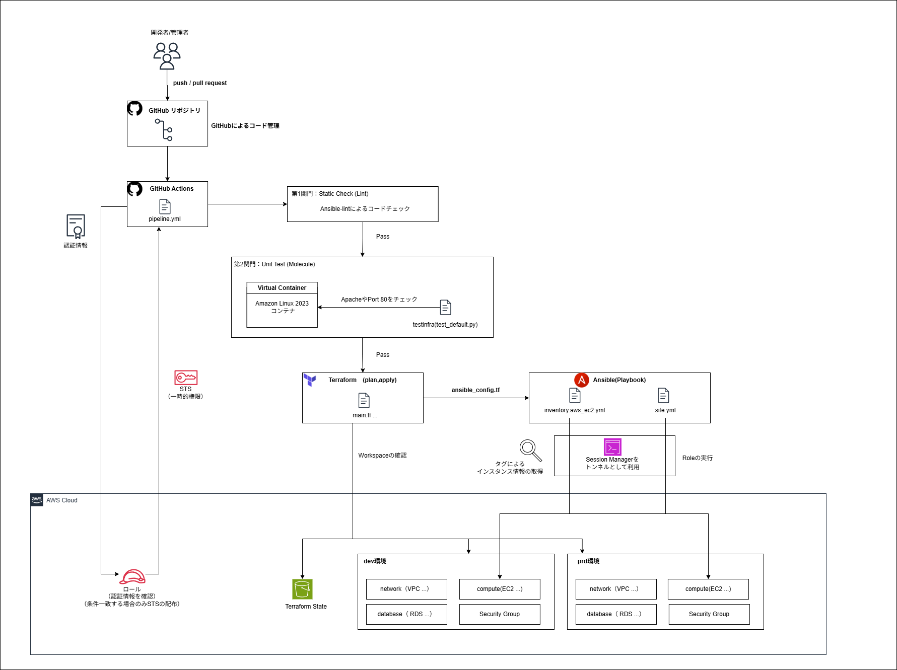

# AWS-Ansible-Terraform 統合GitOpsポートフォリオ

### 〜 ユニットテストとローリングデプロイによる、高信頼性・ゼロダウンタイムCI/CDパイプラインの構築 〜
---

## 🌐 プロジェクト概要

本プロジェクトは、以前作成した[Terraform構築学習](https://github.com/tamuya14/my-aws-infra-portfolio)をベースに、構成管理と自動テストのレイヤーを統合・進化させたものです。
**Terraform（IaC）**と**Ansible（構成管理）**、そして**GitHub Actions（CI/CD）**を用いて、AWSクラウド環境における「堅牢なセキュリティ」「高い保守性」「完全自動化」 を実現するWordPressデプロイパイプラインの構築を目的としています。

単なる「自動構築」に留まらず、実務現場で必須となる **「セキュリティ（SSM経由接続、Secrets Manager）」「品質保証（ansible-lint、Moleculeによるユニットテスト）」「可用性（serial制御によるローリングデプロイ）」**を実装し、コードのPushから本番反映までを「ガードレール」で守られた安全なパイプラインで繋ぐ、現代的なGitOpsプラクティスを体現しています。

---

## 🏗️ システムアーキテクチャ

本プロジェクトでは、GitHub Actions をコントロールタワーとした GitOps スタイルのデプロイフローを採用しています。


<p align="center">図1：本プロジェクト全体のパイプラインフロー</p>

### アーキテクチャの核心
1. **信頼の連鎖 (CI/CD)**: Lint（静的解析）-\> Molecule（動的テスト）-\> Terraform（インフラ構築）-\> Ansible（構成管理）の順で実行され、各フェーズの合格が次のステップの条件となります。
2. **セキュアな認証**: AWS OIDC を利用し、短期間のみ有効なSTSトークンで認証を行うことで、GitHub上に永続的なアクセスキーを置かない安全な運用を実現。
3. **SSMトンネルによる境界防御**: Ansibleの実行時は SSM Session Manager をトンネルとして利用。ターゲットサーバの22番ポートをインターネットに開放せず、閉域網的なアプローチで構成管理を行います。
---

## 🚀 技術スタックと実装パラダイム

| カテゴリ | 技術・ツール | 実装パラダイム / 具体的なアプローチ |
| :--- | :--- | :--- |
| **Cloud** | AWS | **Immutable Infrastructure**: ASGによるインスタンス入れ替え、RDS、ALB |
| **IaC** | Terraform(v1.14.3) | **Multi-Environment**: Workspaceを用いたdev/prd環境分離、default\_tags活用 |
| **Config Mgmt** | Ansible(ansible-core 2.15) | **Role-based & Dynamic**: 役割別の疎結合Role、AWS動的インベントリ、Lookup |
| **CI/CD** | GitHub Actions | **Sequential Pipeline & GitOps**: Branch戦略（feat-\>dev-\>main）と連動した自動化 |
| **Testing** | Molecule, Testinfra, ansible-lint | **Shift-Left**: Dockerを用いたAmazon Linux 2023コンテナ上での動的テスト |
| **Security** | AWS SSM, Secrets Manager, OIDC | **Zero Trust SSH**: インスタンスコネクト＋SSM Proxy、機密情報の動的注入 |
| **Deployment** | Ansible `serial`制御 | **Zero Downtime**: `serial: 1` による1台ずつの逐次更新（ローリングデプロイ） |
---

## 📂 ディレクトリ構成 (Directory Structure)

本リポジトリは、IaC（Terraform）と構成管理（Ansible）を明確に分離し、保守性を高めた構造を採用しています。

```text
.
├── .github/workflows/      # CI/CDパイプライン定義（Day 5-6）
├── ansible/
│   ├── roles/              # 機能別の再利用可能な構成部品
│   │   ├── cloudwatch_agent/ # CloudWatch Logs/メトリクス設定
│   │   └── wordpress/      # WordPress構築。moleculeによるテストを含む
│   ├── group_vars/         # dev/prd等の環境別変数定義
│   ├── inventory.aws_ec2.yml # AWS動的インベントリ設定
│   └── site.yml            # メインのPlaybook
├── terraform/
│   ├── modules/            # network, compute等、役割ごとに分割されたモジュール群
│   ├── main.tf             # 各モジュールを呼び出すメイン定義
│   └── ansible_config.tf   # Ansibleへの変数受け渡し用（Day 3）
├── docs/                   # 学習記録（Day 1-6）とシステム図面一式
├── requirements.in         # Pythonライブラリの抽象的な依存関係（バージョン範囲指定など）
├── requirements.txt        # `pip-compile` により生成された決定論的なリスト

└── README.md
```

---

<a id="setup"></a>

## 🛠️ プロジェクトのセットアップ (Getting Started)

本プロジェクトを自身の環境で再現、または検証するためのセットアップ手順です。

### 1. 前提条件 (Prerequisites)
以下のツールがインストールされていることを想定しています。
- **OS**: Windows 10/11 + WSL2 (Ubuntu 22.04 LTS 推奨)
- **Terraform**: v1.14.x
- **Ansible**: ansible [core 2.20.x]
- **AWS アカウント**: 管理者権限（AdministratorAccess）を持つ IAM ユーザ/ロール
> (学習環境のため、権限によるエラーを防ぐ目的であえて強い権限を付与。本番環境では適切な権限管理が必要)
- **AWS CLI**: v2.x ( `aws configure` により作成したIAM ユーザ/ロールと連携できていること)
- **Session Manager Plugin**: AWS CLI用の拡張プラグイン
- **Python**: v3.9+ (および venv モジュール)
- **Docker Desktop**: WSL Integration が有効であること（Molecule テスト用）
- **AWS Parameter Store:** `/my-project/common/sns_email` を作成済みでSNSの送信先メールアドレスを登録済みであること。
- **GitHub 認証設定**: ローカル環境からGitHubを利用するための認証設定が済んでいること。
   - [GitHub の SSH 鍵作成手順はこちら](https://docs.github.com/ja/authentication/connecting-to-github-with-ssh/generating-a-new-ssh-key-and-adding-it-to-your-ssh-agent)

---

### 2. 開発環境の初期化
WSL2 上のプロジェクトルートで以下のコマンドを実行し、依存ツールをインストールします。
> Pythonライブラリの依存関係は`requirements.txt`に記述しているため、新しいライブラリが必要な場合は `requirements.in` に追記し、`pip-compile` コマンドを実行して `requirements.txt` を更新してください。
```bash
# 1. リポジトリのクローン
git clone https://github.com/tamuya14/ansible-study-portfolio
cd ansible-study-portfolio

# 2. システムパッケージのインストール (Ubuntu/Debian)
まず、OSに最低限必要なツールをインストールします。
```bash
sudo apt-get update
sudo apt-get install -y python3-pip python3-venv git curl wget unzip lsb-release gnupg software-properties-common

# 3. Python 仮想環境の作成と有効化(ツール間の依存関係を分離するため)
python3 -m venv .venv
source .venv/bin/activate

# 4. 必要パッケージの一括インストール
# Ansible, Terraform, Molecule, AWS CLI, Boto3 等
pip install --upgrade pip
pip install -r requirements.txt  # ※作成した requirements.txt を参照
```
<br>

### 3. 必要なツールのインストール

本プロジェクトで使用するTerraformやAWSの操作に必要なツールのインストールを行います。

#### Terraformのインストール
```bash
# 1. 署名鍵とリポジトリを追加（コピー＆ペーストで一気にOK）
wget -O- https://apt.releases.hashicorp.com/gpg | sudo gpg --dearmor -o /usr/share/keyrings/hashicorp-archive-keyring.gpg
echo "deb [signed-by=/usr/share/keyrings/hashicorp-archive-keyring.gpg] https://apt.releases.hashicorp.com $(lsb_release -cs) main" | sudo tee /etc/apt/sources.list.d/hashicorp.list
 
# 2. インストール
sudo apt update && sudo apt install terraform -y
 
# 3. 確認（バージョンが出れば成功）
terraform -v
```

#### AWS CLIのインストール
```bash
# 1. ダウンロードしてインストール
curl "https://awscli.amazonaws.com/awscli-exe-linux-x86_64.zip" -o "awscliv2.zip"
unzip awscliv2.zip
sudo ./aws/install

# 2. 確認（バージョンが出れば成功）
aws --version
```

#### Session Manager Pluginのインストール
```bash
# 1. ダウンロードとインストール
curl "https://s3.amazonaws.com/session-manager-downloads/plugin/latest/ubuntu_64bit/session-manager-plugin.deb" -o "session-manager-plugin.deb"
sudo dpkg -i session-manager-plugin.deb

# 2. 確認（バージョンが出れば成功）
session-manager-plugin --version
```

#### AWS環境構築のための認証情報の設定
```bash
aws configure --profile <your_profile_name>
#対話形式で入力：
AWS Access Key ID: 演習用ユーザのアクセスキーを入力
AWS Secret Access Key: 演習用ユーザのシークレットキーを入力
Default region name: ap-northeast-1 (東京リージョン)
Default output format: json

# 確認1: ローカルに設定ファイルが作成されたか
ls -l ~/.aws/
# config と credentials が表示されればファイル作成は成功

# 確認2: AWSとの疎通できているか
aws sts get-caller-identity --profile <your_profile_name>
# 期待される出力例: { "UserId": "AID...", "Account": "************(12桁のID)", "Arn": "..." }

# (予備) S3 バケット一覧の表示
aws s3 ls --profile <your_profile_name>
```


#### 不要ファイルの削除
```bash
# 学習用ディレクトリ（~/work/aws-ansible-study）にいることを確認して実行
rm -rf aws awscliv2.zip session-manager-plugin.deb
```

<br>

### 4. Terraform Backend (S3) の準備
State ファイルを管理する S3 バケットをあらかじめ作成し、`main.tf` の backend 設定を**自身の環境**に合わせて書き換えます。

```hcl
terraform {
  backend "s3" {
    bucket         = "YOUR-UNIQUE-S3-BUCKET-NAME"           #必ず自身のもの(一意のもの)に書き換えること
    key            = "aws-ansible-study/terraform.tfstate"
    region         = "ap-northeast-1"
    dynamodb_table = "YOUR-DYNAMODB-TABLE-NAME"             #必ず自身のもの(一意のもの)に書き換えること
    encrypt        = true
  }
}
```
<br>

### 5. Ansible Collection の導入
AWSとの動的連携やSecrets Managerの参照に必要なコレクションを導入します。（※ `requirements.txt` のインストールにより既に導入されている場合がありますが、念のため実行を推奨します）

```bash
ansible-galaxy collection install amazon.aws community.docker community.general
```
<br>

### 6. 認証情報の設定 (Secrets)
GitHub Actions で実行する場合は、リポジトリの `Settings > Secrets and variables > Actions` に以下のシークレットを登録してください。
* `AWS_ACCOUNT_ID`: AWSアカウント番号
* `SSH_PRIVATE_KEY`: EC2接続用の秘密鍵 (BEGIN/END行を含む)
(秘密鍵の作成についてdocs/Day2.md 参照)
<br>

---

### 7. 実行コマンド (Usage)

#### Step 1: インフラのデプロイ (Terraform)
まずは AWS 上に VPC や EC2 インスタンスを作成します。

```bash
# Terraform ディレクトリに移動
cd terraform
# Terraform の初期化と展開
terraform init
# 開発用ワークスペースの作成と切り替え (Day 5)
terraform workspace new dev
terraform workspace select dev
# 実行計画の確認と適用
terraform plan
terraform apply 
# 本番環境も確認する場合は以下も実施
terraform workspace new prd
terraform workspace select prd
terraform plan
terraform apply 
```

#### Step 2: 接続確認 (SSM Session Manager)
インフラ構築後、SSM を利用してインスタンスへの疎通確認を行います。
以下のコマンドは、Terraform から ASG 名を取得し、実行中のインスタンスへ自動で接続します。

**接続の前提条件**:

 - 操作ユーザーに `ssm:StartSession` 権限が付与されていること。

 - インスタンスに SSM Agent がインストールされ、IAM ロールが適切に付与されていること。

 - `outputs.tf` で `asg_name` を出力設定にしていること。
> ※ terraform ディレクトリで実行してください

```bash
# ※ terraform ディレクトリで実行してください
# 1. Terraform から ASG 名を取得し、所属する実行中のインスタンス ID を特定
ASG_NAME=$(terraform output -raw asg_name)
INSTANCE_ID=$(aws ec2 describe-instances \
  --filters "Name=tag:aws:autoscaling:groupName,Values=$ASG_NAME" \
            "Name=instance-state-name,Values=running" \
  --query "Reservations[0].Instances[0].InstanceId" \
  --output text)

# 2. SSM でログイン（キーペア不要）
aws ssm start-session --target $INSTANCE_ID
```

#### Step 3: 構成管理の適用 (Ansible)
インスタンスへの接続が確認できたら、ミドルウェア（WordPress等）をセットアップします。

```bash
# Ansibleディレクトリに移動
cd ../ansible

# 接続確認コマンド
ansible web_servers -i inventory.aws_ec2.yml -m ping

# 動的インベントリを利用した Playbook の実行
ansible-playbook -i inventory.aws_ec2.yml site.yml
```

#### Step 4: ローカルテストの実行 (Molecule)
```bash
# WordPress ロールのユニットテスト
cd roles/wordpress
# 初めてのテストの際は初期化を実施
# molecule init scenario
molecule test
```

---

## 🛠️ パイプラインの詳細とガードレール機構

本プロジェクトの核心は、システムアーキテクチャ図に描かれたGitHub Actions内の多層防御システム（ガードレール）にあります。

### 第1関門：静的解析 (Static Check / Lint)

  * **ansible-lint**: 全てのAnsibleコードに対し、構文エラー、FQCN（完全修飾コレクション名）の使用、非推奨モジュールの回避などをPush時に自動チェックします。これにより、コード品質を均一化し、初歩的なミスを本番環境へ持ち込ませません。

### 第2関門：ユニットテスト (Unit Test / Molecule)

  * **Molecule + Docker**: GitHub Actions上で Amazon Linux 2023 のコンテナを爆速で立ち上げ、実際にwordpressロールを適用します。
  * **Jinja2先行評価の克服**: `boto3`（Pythonライブラリ）の依存性解決や、AWS Lookupプラグインの認証エラー（先行評価）を、Jinja2の遅延評価的記述（`default`フィルタ）とMolecule側のダミー環境変数設定により克服。「AWSに依存しない、純粋なRole単体テスト」をCI上で実現しました。
  * **Testinfraによる検証**: 構築後のコンテナに対し、「Apacheは動いているか？」「80番ポートは開いているか？（`net-tools`コマンドの不在も検知）」をPythonコードで動的に検証します。

### 第3関門：インフラ構築 & ローリングデプロイ (Terraform & Ansible)

  * **Terraform Plan/Apply**: テストをパスしたコードのみがここへ到達。TerraformがAWS上のASG設定を更新（例：インスタンス数増）し、そのインフラ情報を `ansible_config.tf` 経由でAnsibleへ渡します。
  * **ローリングアップデート (`serial: 1`)**: AnsibleはAWS動的インベントリでターゲットを自動特定し、**`serial: 1`** の設定に基づき、1台ずつ順番にWordPressの更新とサービスの再起動を実行します。ALBのヘルスチェックと連動し、1台目の生存確認が取れてから2台目へ進むため、**ユーザー影響ゼロ（ゼロダウンタイム）**でのデプロイが完了します。
---

## 📖 学習ログ（技術選定と試行錯誤の軌跡）

本プロジェクトは6日間の段階的な学習と実装を経て完成しました。各チャプターには、実務で遭遇するトラブルと、それを解決したプロセスが詳細に記録されています。

⚠️ **本ドキュメントの性質について**

各Chapterに掲載しているリンク先のドキュメントは、本プロジェクト完成に至るまでの学習プロセスを記録したログです。
当時の試行錯誤やエラー解決の過程を重視して記述しているため、一部の手順やコードは最終的なリポジトリの構成（README参照）と異なる、または不十分な箇所があります。
最新かつ再現性のある構築手順については、本`README.md`の[🛠️ プロジェクトのセットアップ (Getting Started)](#setup)を参照してください。

<details>
<summary> 🎓 Chapter 1：Ansibleの基礎とWSL2ローカル環境の構築 </summary>

  - **内容**: WSL2（Ubuntu）上へのAnsibleインストールと、基本的なモジュール、Playbook、変数の使い方を学習。
  - **Tips**: WSL2特有のPythonインタープリター設定や、管理者権限（`become`）の扱いについて。
  - **技術**: WSL2, Python venv, Ansible, Terraform.
  - **リンク**: [学習ログの詳細はこちら](./docs/day1_env_setup.md)

</details>

<details>
<summary> 🔐 Chapter 2：SSM Proxyによる、踏み台サーバ不要のセキュアSSH接続 </summary>

  - **内容**: プライベートサブネットにあるEC2インスタンスに対し、踏み台サーバを立てずに、AWS Systems Manager（SSM）をProxyとしてセキュアにSSH接続する環境を構築。
  - **試行錯誤**: `ProxyCommand`、`aws ec2-instance-connect`、`.ssh/config`の高度な設定と認証トラブルの解消。
  - **Tips**: **SSMトンネル** + **EC2 Instance Connect** を採用することで、鍵をサーバに残さない「エフェメラル（一時的）」な認証運用を実装。
  - **技術**: AWS Systems Manager (SSM), EC2 Instance Connect.
  - **リンク**: [学習ログの詳細はこちら](./docs/day2_ssh_ssm_setup.md)

</details>

<details>
<summary> 🧩 Chapter 3：TerraformとAnsibleの疎結合連携によるImmutable Architecture </summary>

  - **内容**: Terraformでインフラ（VPC, RDS, ASG）を構築し、AnsibleでWordPressをセットアップ。UserDataを削除し、OS内をAnsibleで焼き直す（Immutable）運用へ移行。
  - **疎結合設計**: `ansible_config.tf`（Terraform）から `group_vars`（Ansible）へ、Secrets Managerの「シークレット名」を渡す「バトンタッチ」フローの実装。
  - **Tips**:`ansible_config.tf`によってTerraformで払い出したDS等の動的情報を、Ansibleへ自動受け渡し。手動介入を排除した「疎結合な連携」を実現。
  - **技術**: Terraform `local_file`, Ansible Templates, RDS.
  - **リンク**: [学習ログの詳細はこちら](./docs/day3_WordPress_setup.md)

</details>

<details>
<summary> 🤖 Chapter 4：動的インベントリとRoleによる、疎結合・再利用可能な構成管理 </summary>

  - **内容**: インスタンスIDの手動指定を廃止。AWSタグベースの「動的インベントリ」を導入。また、CloudWatchエージェントとWordPressの構成を、疎結合な「Role」構造へ整理。
  - **技術的考察**: `loop` と `item` によるタスクの抽象化。動的インベントリにおける `ansible_host: instance_id` の別名定義とSSH Proxy設定の整合。
  - **Tips**: AWSタグによるターゲットの自動抽出によってAuto Scalingによるインスタンス増減にも自動追従する仕組みを実装。
  - **技術**: Ansible Roles, AWS Dynamic Inventory, CloudWatch Agent.
  - **リンク**: [学習ログの詳細はこちら](./docs/day4_CloudWatchAgent_Roles_setup.md)

</details>

<details>
<summary> 🌟 Chapter 5：フルオートメーションの実装 〜GitHub ActionsによるCI/CDと環境分離〜 </summary>

  - **内容**: GitHub Actionsを導入。`push`をトリガーにインフラ更新（Plan/Apply）とAnsible実行をシーケンシャルに行うフルオートメーションパイプラインの実装。`cron`による自動リソース削除も実装。
  - **環境分離（Multi-Environment）**: `dev` / `main` ブランチと、Terraform Workspace、そしてAnsibleの動的インベントリフィルタ（`filters: tag:Env: {{lookup('env', 'TF_WORKSPACE')}}`）を完璧に連動させ、1つのコードで独立した2環境を制御。
  - **試行錯誤の集大成**: \* **Python環境の罠**: Actions上の隔離されたAnsible環境（pipx）と、ライブラリ（boto3）の不一致を克服。
      * **秘密鍵の『完全な』復元**: Secretsへの保存形式（BEGIN/END含む）、`cat`による復元、公開鍵生成、権限設定（`600`）の一連の流れを確立。
      * **タグ伝播（Propagate）**: ASG定義での `propagate_at_launch = true` の徹底。
  - **Tips**: Push/PRをトリガーにした自動デプロイ。Terraform WorkspaceとGitブランチを連動させ、dev/prd環境を安全に制御。
  - **技術**: GitHub Actions, OIDC, Terraform Workspace.
  - **リンク**: [学習ログの詳細はこちら](./docs/day5_CICD_setup.md)

</details>

<details>
<summary> 🚀 Chapter 6：テスト駆動インフラ開発の実装 〜Moleculeによる品質保証とローリングアップデート〜 </summary>

  - **内容**: インフラのユニットテスト（Molecule）と、ゼロダウンタイムデプロイ（serial制御）の実装。CI/CDパイプラインへの「ガードレール」統合。
  - **MoleculeのActions対応（高度トラブルシューティング）**: \* \*\* systemd の壁 (Exit 255)\*\*: GitHub ActionsRunner（Cgroup V2）とコンテナ内systemdの競合を、`cgroupns_mode: host` の指定により突破。
      * **Lookupプラグインの「先行評価」**: テスト環境でのAWSlookupを防ぐためのモック変数注入とJinja2条件分岐の徹底。
  - **ローリングアップデートの実装**: Playbookへの `serial: 1` 導入。ALBのヘルスチェックと連動した、安全な逐次更新プロセスの確立。
  - **パイプライン統合**: `ansible-lint` -\> `molecule` -\> `terraform_deploy` の依存関係（`needs`）設定による多層防御。
  - **Tips**: **Molecule** によるユニットテストの実装。テスト合格後のみ本番へ反映される「信頼の連鎖」と、**ローリングアップデート**によるゼロダウンタイム更新。
  - **技術**: Molecule, Testinfra, Docker, Rolling Updates (`serial: 1`).
  - **リンク**: [学習ログの詳細はこちら](./docs/day6_molecule-pipeline_setup.md)

</details>

---

## 🛠 技術的挑戦と課題解決（Troubleshooting）

本プロジェクトの構築過程で直面した、構造的な技術課題とその解決プロセスです。単なる設定変更に留まらず、ツールの内部挙動やドキュメントを深く読み解くことで解決に導きました。

### 1. 外部依存（AWS Secrets Manager）とテストの完全分離
**【課題】**
AnsibleからRDSの認証情報を動的に取得するため、当初はコミュニティコレクションのモジュールを検討しましたが、`ansible-doc` を活用した徹底的な調査の結果、要件を満たす機能が既存モジュールにないことを突き止めました。最終的に `amazon.aws.aws_secret` Lookupプラグインを採用しましたが、今度はMoleculeによるユニットテスト（Docker環境）において、プラグインの**「先行評価（Eager Evaluation）」**の性質により、AWS認証情報がない環境でテストが強制終了する問題が発生しました。

**【解決策】**
1.  **grepによるプラグイン探索**: `ansible-doc` と `grep` を組み合わせ、メタデータから「Secrets Manager」に関連するプラグインを自力で特定しました。
2.  **評価遅延のシミュレーション**: Jinja2テンプレート内での `` 制御を徹底し、変数が定義済み（テスト環境）であればLookup自体をスキップするロジックを実装。
3.  **Dummyインジェクション**: `molecule.yml` 内にダミーのAWS認証情報を注入し、プラグインの初期化プロセスを擬似的にパスさせることで、外部依存のない純粋なユニットテストを実現しました。


### 2. GitHub Actionsにおける実行環境の「不一致」解決
**【課題】**
GitHub Actions上でパイプラインを実行した際、必要なライブラリ（boto3）をインストールしているにも関わらず「モジュールが見つからない」というエラーが発生。これは、Actions標準のAnsibleが `pipx` による独立した仮想環境で動作している一方、ライブラリがシステムPythonにインストールされていたという、実行主体の乖離が原因でした。

**【解決策】**
複雑なパス指定や環境変数の調整を避け、**「システム側のPython環境にAnsible本体（ansible-core）とライブラリを一括インストールする」**という、最もシンプルかつ堅牢な構成へシフト。自動化環境において「どのPythonが主導権を握っているか」を常に意識する重要性を学びました。


### 3. Cgroup V2環境下でのシステムコンテナ制御
**【課題】**
GitHub Actionsのホスト（Ubuntu 22.04以降）が採用する **Cgroup V2** と、コンテナ内の **systemd** のリソース管理の視界が不一致を起こし、Amazon Linux 2023コンテナが起動直後に `Exit 255` で停止する事象に直面しました。

**【解決策】**
`molecule.yml` において `privileged: true` に加え、**`cgroupns_mode: host`** を明示。ホストとコンテナのNamespaceの視界を同期させることで、コンテナ内でのミドルウェア（Apache等）の起動を安定させました。これにより、OSに近いレイヤーの構成管理もCI上で検証可能となりました。


### 4. セキュアな「踏み台レス」接続基盤の構築
**【課題】**
セキュリティ要件として22番ポートの閉鎖が必須でしたが、CI/CDパイプラインからの自動アクセスを維持する必要がありました。

**【解決策】**
**SSM Session Manager** を SSHの `ProxyCommand` に組み込み、さらに **EC2 Instance Connect** を併用。接続の瞬間にだけ有効な公開鍵をAWS API経由でプッシュし、SSMトンネルを通して通信する「鍵をサーバに残さない」使い捨て認証フローを確立。セキュリティと自動デプロイの両立を達成しました。

---

## 📈 学習の総括：Tips & Lessons Learned

この6日間のプロジェクトを通じて、インフラを「コード」として扱うだけでなく、「ソフトウェア開発と同等の品質基準」で管理・運用するためのマインドセットを獲得しました。

  * **「シフトレフト」の体現**:
    手動で `destroy` して再作成する手間（Day5の自動cleanup導入）や、実行環境ごとの不確実性（Day6のMolecule導入）に対し、テストと自動化を「前段（シフトレフト）」に置くことで、開発効率と本番環境の安全性が劇的に向上することを体感しました。
  * **「手元で動く」は証明にならない**:
    WSL2という「暗黙の前提条件（過去の認証情報やライブラリ）」が残る環境での成功に安住せず、CIという「真っさらな第三者の環境」でテストを完走させて初めて、コードの真の再現性（ポータビリティ）が担保されることを学びました。
  * **イミュータブルな運用意識**:
    ASGのタグ伝播問題（Day5）を通じ、クラウドでは「既存インスタンスを直す」のではなく「設定を変えて、ASGに焼き直させる（再生成）」という、Immutable Infrastructureの思考が、予測可能な運用には不可欠であることを学びました。
  * **オーケストレーションの真髄**:
    `serial: 1` の設定（Day6）を通じ、Ansibleが単なる設定注入ツールではなく、システム全体の「可用性」をダウンタイムを制御しながら担保する「指揮者（オーケストレーター）」としての役割を持つことを体感しました。
  * **秘密情報の完全な復元**:
    秘密鍵は単なる文字列ではなく「構造体」であることをDay5での失敗を通じて理解しました。ヘッダー/フッター、改行コードを含む「そのままの形」で Secrets から復元することが、SSH認証トラブルを防ぐ唯一の道であることを学びました。
---

## 📝 今後の展望

  - **テストカバレッジの拡大**: CloudWatchロール等、全ロールへのMoleculeテスト適用。

  - **OS Hardening**: CISベンチマークに基づいた、よりセキュアなLinux初期設定タスクの追加。

  - **マルチOS対応**: Windows Serverへの対応を見据えた、WinRM/OpenSSH接続の共通化。

  - **監視の統合**: CloudWatch Syntheticsを用いた外形監視による、デプロイ後の即時異常検知。
  
  - **コンテナ化（ECS/Fargate）への移行**: 起動速度の向上とさらなるイミュータブル化を目指す。
  
  - **可観測性（Observability）の向上**: Datadog等をパイプラインに統合し、デプロイ時のパフォーマンス変化を即座に検知。
-----
© 2026 tamuya14

このプロジェクトは、技術のつながりを深く理解し、安全できれいインフラを作るための挑戦記録です。

All rights reserved.
